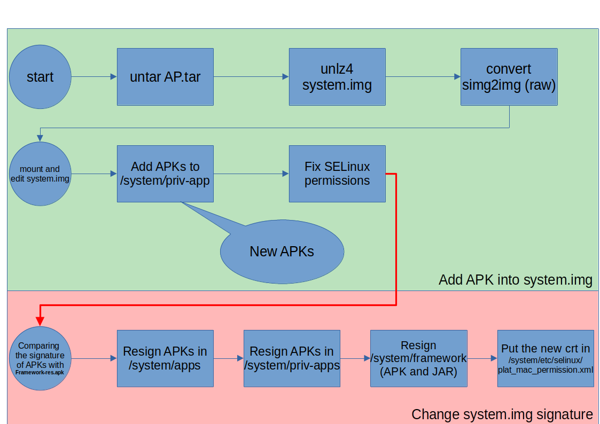

# System Image Modification

System Image Modification (SIM) is a small demonstration of [this script](https://gist.github.com/tonio-nucci/8ff2894c42c6320a50dc4b70b32a716a) for Android System Image modification. The whole scenario is about mounting ```system.img``` of the Android System and modifying it and then rebuilding the image.

The whole process of the system image modification is depicted in below:




# Slides

The slides of my presentation about this, is located in https://www.slideshare.net/MirSamanTajbakhsh/android-system-image-modification

# YouTube Video

[](https://youtu.be/yZgYIaSm2ZE)

# Blog Post

https://mstajbakhsh.ir/android-system-image-modification/
